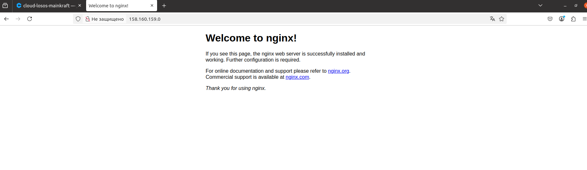
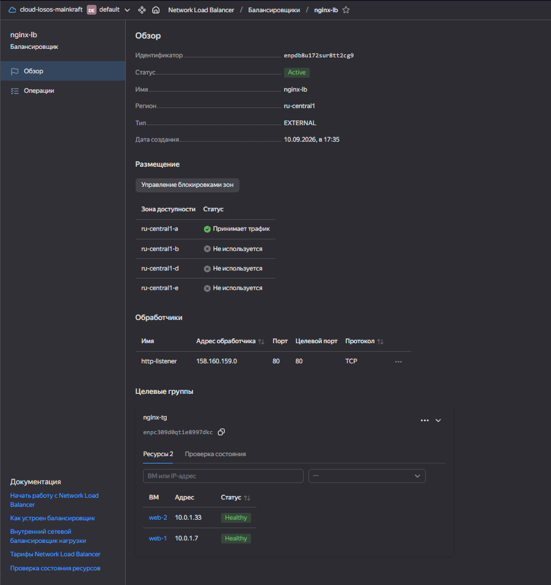

#Домашнее задание "Отказоустойчивость в облаке" Городилов Лев

### 1. Terraform конфигурация (main.tf)

```hcl
data "yandex_compute_image" "ubuntu" {
  family = "ubuntu-2204-lts"
}

resource "yandex_vpc_network" "develop" {
  name = "develop"
}

resource "yandex_vpc_subnet" "develop" {
  name           = "develop-ru-central1-a"
  zone           = "ru-central1-a"
  network_id     = yandex_vpc_network.develop.id
  v4_cidr_blocks = ["10.0.1.0/24"]
}

resource "yandex_compute_instance" "web" {
  count = 2
  name  = "web-${count.index + 1}"

  resources {
    cores         = 2
    memory        = 1
    core_fraction = 5
  }

  boot_disk {
    initialize_params {
      image_id = data.yandex_compute_image.ubuntu.id
      type     = "network-hdd"
      size     = 10
    }
  }

  scheduling_policy {
    preemptible = true
  }

  network_interface {
    subnet_id = yandex_vpc_subnet.develop.id
    nat       = true
  }

  metadata = {
    serial-port-enable = "1"
    ssh-keys           = "ubuntu:${file("~/.ssh/id_ed25519.pub")}"
    user-data          = <<-EYOU
      #cloud-config
      package_update: true
      packages:
        - nginx
      runcmd:
        - systemctl enable nginx
        - systemctl start nginx
    EYOU
  }
}

resource "yandex_lb_target_group" "tg" {
  name      = "nginx-tg"
  folder_id = var.folder_id

  dynamic "target" {
    for_each = yandex_compute_instance.web
    content {
      subnet_id = yandex_vpc_subnet.develop.id
      address   = target.value.network_interface[0].ip_address
    }
  }
}

resource "yandex_lb_network_load_balancer" "nlb" {
  name = "nginx-lb"

  listener {
    name = "http-listener"
    port = 80
    external_address_spec {
      ip_version = "ipv4"
    }
  }

  attached_target_group {
    target_group_id = yandex_lb_target_group.tg.id

    healthcheck {
      name = "http-healthcheck"
      http_options {
        port = 80
        path = "/"
      }
    }
  }
}
```



